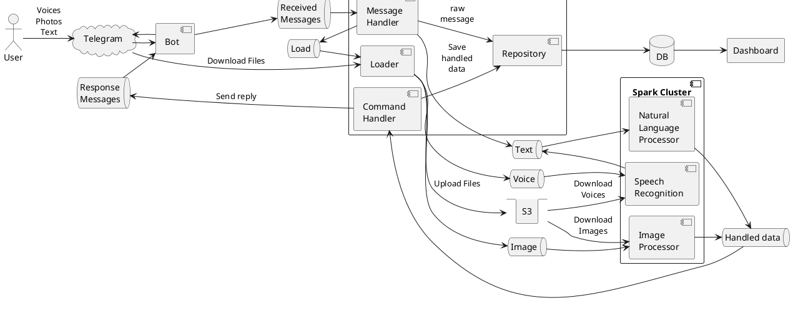

# Простой учет финансов

Сервис для учета личных финансов с интерфейсом через чат-бота Telegram.

## TL;DR

### Start:

```shell
docker compose -f Docker-compose.yaml -p easy-money up -d --build
```

### Stop:

```shell
docker compose -f Docker-compose.yaml down
```

### Build backend
```shell
docker build --tag $(minikube ip):5000/backend-application:latest .
docker push $(minikube ip):5000/backend-application:latest
```

## Принцип работы

### Входные данные

Пользователь может вносить траты или поступления несколькими способами:

- Текстовым сообщением в чате с ботом,
- Голосовым сообщением боту,
- Фотографией чека.

### Процесс обработки
1. Бот получает сообщения от пользователя и отправляет их в стрим сообщений.
2. Дальше система обработки сообщений определяет тип сообщения: голос, изображение, текст и отправляет его в целевой
   конвейер процессинга.
3. Система процессинга состоит из модулей:
    - Модуль обработки голосовых сообщений преобразовывает речь в текст.
    - Модуль обработки естественного языка преобразует текстовые команды в очищенные данные для записи в базу.
    - Модуль обработки изображений распознает QR коды чеков и передает их в парсер для последующей обработки.
4. Обработанные данные записываются в базу.
5. Пользователю отправляется подтверждение с деталями операции.

### Выходные данные

Выходными данными служат дашборды с информацией по расходам, а также отчеты может формировать бот и отправлять их
пользователю в чат.

## Технологический стек

### Программное обеспечение

- База данных: PostgreSQL;
- Брокер: Kafka;
- Файловое хранилище: S3 (Minio - dev, Object Storage - prod);
- Деплой: K8S + Helm
- Инфраструктура: Minikube или Docker Compose - dev, Yandex Cloud - prod

### Бэкенд - stateless монолит на Java 17 и Spring Boot 3.1.0

- API: Spring Web + Spring Actuator
- ORM: Spring Data JPA
- Bot: telegrambots
- AWS: spring-cloud-aws-starter-s3
- Kafka: spring-kafka (простой темплейт для продюсера и аннотация подписчика)
- Project Lombok - уменьшить бойлерплейт код
- Билд: gradle, Dockerfile, Helm Chart

### Spark:

- Работа с Кафкой: Spark SQL, Spark Structured Streaming
- Загрузка файлов: Hadoop AWS
- Детектор QR:
  - SparkML (загрузка изображений в opencv формате)
  - Доступ к нативному коду OpenCV: JavaCPP + JavaCV
  - Детектор: OpenCV  WeChat QRCode
- NLP: SparkNLP

## Общая схема системы



