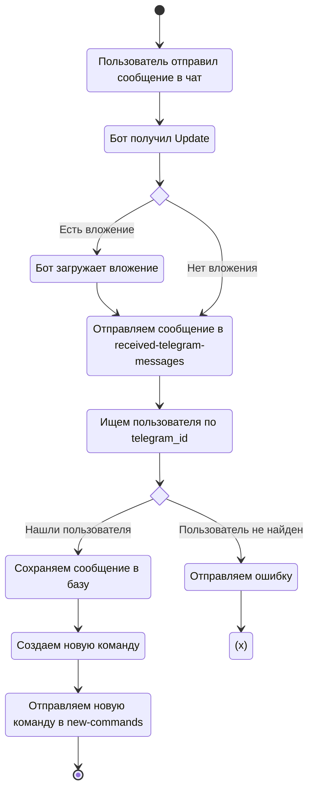
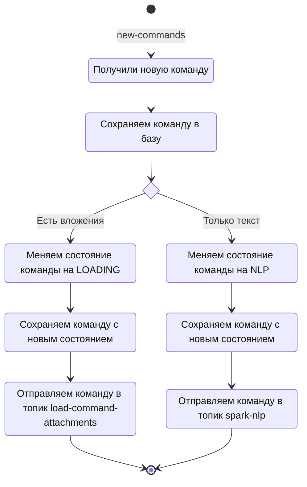
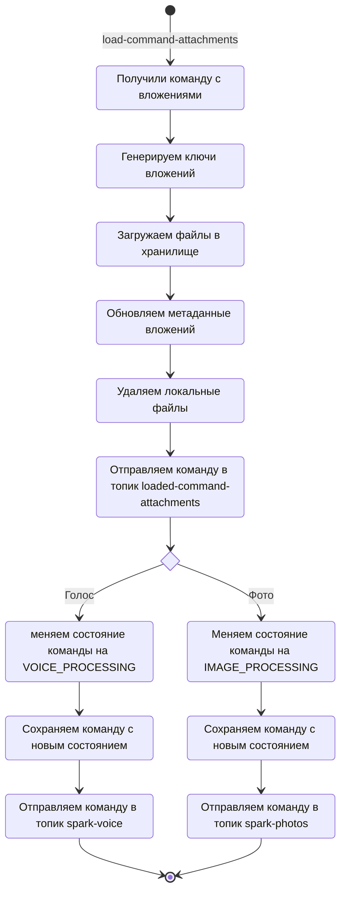

```mermaid
erDiagram
    account {
        bigserial id PK
        bigint owner_id FK
        varchar account_group
        varchar name
        smallint account_type
        varchar currency
        timestamp created_date
        timestamp last_modified_date
    }
    category {
        bigserial id PK
        varchar category_group
        varchar name
        timestamp created_date
        timestamp last_modified_date
    }
    command {
        bigserial id PK
        uuid uuid UK
        bigint telegram_message_id FK
        smallint source
        smallint state
        smallint type
        text content
        text error
        text sql
        bigint user_id
        timestamp created_date
        timestamp last_modified_date
    }
    command_attachment {
        bigserial id PK
        uuid uuid
        bigint command_id FK
        varchar url
        varchar telegram_id
        varchar storage_id
        varchar filename
        bigint filesize
        varchar mime_type
    }
    counterparty {
        bigserial id PK
        varchar counterparty_group
        varchar name
        varchar external_id
        timestamp created_date
        timestamp last_modified_date
    }
    invoice {
        bigserial id PK
        uuid uuid UK
        bigint seller_id FK
        bigint user_id FK
        bigint account_id FK
        timestamp date_time
        varchar external_id
        varchar url
        text content
        varchar currency
        numeric sum
        timestamp created_date
        timestamp last_modified_date
    }
    invoice_item {
        bigserial id PK
        bigint invoice_id FK
        bigint item_id FK
        real quantity
        numeric unit_price
        numeric price
    }
    item {
        bigserial id PK
        bigint category_id FK
        varchar external_id UK
        varchar item_group
        varchar name
        timestamp created_date
        timestamp last_modified_date
    }
    telegram_message {
        bigserial id PK
        uuid uuid UK
        bigint user_id FK
        timestamp message_date
        integer update_id
        integer message_id
        bigint chat_id
        bigint tg_user_id
        varchar voice_file_path
        varchar photo_file_path
        text text
        jsonb update
        jsonb file_metadata
        timestamp created_date
        timestamp last_modified_date
    }
    transaction {
        bigserial id PK
        bigint account_id FK
        bigint category_id FK
        bigint counterparty_id FK
        bigint invoice_id FK
        bigint user_id FK
        uuid uuid
        timestamp timestamp
        boolean draft
        smallint transaction_type
        varchar currency
        numeric sum
        varchar comment
        timestamp created_date
        timestamp last_modified_date
    }
    users {
        bigserial id PK
        varchar login UK
        varchar name
        varchar password
        bigint telegram_id
        timestamp created_date
        timestamp last_modified_date
    }

    telegram_message }o--|| users: user_id
    telegram_message ||--o{ command: telegram_message_id
    command ||--o{ command_attachment: command_id
    command }o--|| users: user_id
    users ||--o{ account: owner_id
    users ||--o{ invoice: user_id
    account ||--o{ transaction: account_id
    account ||--o{ invoice: account_id
    invoice }o--|| counterparty: seller_id
    invoice ||--|{ invoice_item: invoice_id
    invoice_item }|--|| item: item_id
    users ||--o{ transaction: user_id
    transaction }o--|| category: category_id
    category ||--o{ item: category_id
    transaction }o--|| counterparty: counterparty_id
    transaction }o--|| invoice: invoice_id
```

# Простой учет финансов

Сервис для учета личных финансов с интерфейсом через чат-бота Telegram.

## TL;DR

### Создаем в корне проекта .env файл:

```dotenv
SERVER_PORT="80"
DOWNLOADS_PATH=/tmp/downloads

BOT_TOKEN=""
BOT_NAME="@my_shiny_public_bot"

KAFKA_BOOTSTRAP="kafka:9092"

DB_DATABASE="easy-money"
DB_URL="jdbc:postgresql://postgres:5432/${DB_DATABASE}"
DB_USER="admin"
DB_PASS="P@ssw0rd"

MINIO_ROOT_USER="admin"
MINIO_ROOT_PASSWORD="P@ssw0rd"

AWS_REGION="local"
AWS_BUCKET="easy-money"
AWS_S3_ENDPOINT="http://minio:9000"
AWS_ACCESS_KEY_ID=""
AWS_SECRET_ACCESS_KEY=""
```

### Запускаем с флагом сборки:

```shell
docker compose -f Docker-compose.yaml -p easy-money up -d --build
```

### Stop:

```shell
docker compose -f Docker-compose.yaml down
```

## Принцип работы

### Входные данные

Пользователь может вносить траты или поступления несколькими способами:

- Текстовым сообщением в чате с ботом,
- Голосовым сообщением боту,
- Фотографией чека.

### Процесс обработки
1. Бот получает сообщения от пользователя и отправляет их в стрим сообщений.
2. Дальше система обработки сообщений определяет тип сообщения: голос, изображение, текст и отправляет его в целевой
   конвейер процессинга.
3. Система процессинга состоит из модулей:
    - Модуль обработки голосовых сообщений преобразовывает речь в текст.
    - Модуль обработки естественного языка преобразует текстовые команды в очищенные данные для записи в базу.
    - Модуль обработки изображений распознает QR коды чеков и передает их в парсер для последующей обработки.
4. Обработанные данные записываются в базу.
5. Пользователю отправляется подтверждение с деталями операции.

### Выходные данные

Выходными данными служат дашборды с информацией по расходам, а также отчеты может формировать бот и отправлять их
пользователю в чат.

## Технологический стек

### Программное обеспечение

- База данных: PostgreSQL;
- Брокер: Kafka;
- Файловое хранилище: S3 (Minio - dev, Object Storage - prod);
- Деплой: K8S + Helm
- Инфраструктура: Minikube или Docker Compose - dev, Yandex Cloud - prod

### Бэкенд - stateless монолит на Java 17 и Spring Boot 3.1.0

- API: Spring Web + Spring Actuator
- ORM: Spring Data JPA
- Bot: telegrambots
- AWS: spring-cloud-aws-starter-s3
- Kafka: spring-kafka (простой темплейт для продюсера и аннотация подписчика)
- Project Lombok - уменьшить бойлерплейт код
- Билд: gradle, Dockerfile, Helm Chart

### Spark:

- Работа с Кафкой: Spark SQL, Spark Structured Streaming
- Загрузка файлов: Hadoop AWS
- Детектор QR:
  - SparkML (загрузка изображений в opencv формате)
  - Доступ к нативному коду OpenCV: JavaCPP + JavaCV
  - Детектор: OpenCV  WeChat QRCode
- NLP: SparkNLP

## Общая схема системы

### Главные компоненты приложения

- **Bot** - отвечает за общение с Telegram-API;
- **Message Processor** - обработчик телеграм сообщений;
- **Command Processor** - отвечает за бизнес-логику и обработку команд;
- **Message Gateway** - отправка в брокер сообщений;
- **Loader** - загружает вложения в файловое хранилище;
- **Parser** - получает по ссылке данные чека и преобразует их в объекты приложения;
- **Transaction Service** - сервис управления транзакциями;
- **Repository** - механизм общение с базой данных.


## Описание данных

### Основные таблицы

- **users** - пользователи системы;
- **telegram_message** - стейджинг-таблица для сообщений из Телеграм;
- **command** - таблица для хранения состояния команд пользователя;
- **command_attachment** - метаданные файлов команд;
- **transaction** - операции движения денежных средств;
- **account** - кошелек или счёт в банке;
- **counterparty** - контрагент транзакции (магазин);
- **category** - категория дохода или расхода;
- **invoice** - чек или счёт из магазина;
- **item** - товар или услуга из чека;
- **invoice_item** - табличная часть чека, содержит: количество, цену и сумму товарной позиции.

### Схема данных




## Обработка данных

### Телеграм сообщение (STG)

1. Пользователь отправляет сообщение в чате.
2. Бот получает Update с сообщением из Telegram API.
3. Преобразовывает объект Telegram API Update во внутренний объект системы Telegram Message (TM).
4. Определяет наличие вложения и его тип.
5. Если есть вложение, загружает его в локальную файловую систему.
6. Ссылка на файл и метаданные сохраняется в объекте сообщения.
7. Если во время загрузки что-то пошло не так, либо формат файла неизвестен - пользователю отправляется ответ с ошибкой.
8. Далее объект TM отправляется в Message Gateway (MG)
9. MG сериализует объект в JSON и отправляет в топик received-telegram-messages.
10. Message Processor (MP) подписан на топик received-telegram-messages.
11. MP получает десериализованный объект TM.
12. MP ищет в базе пользователя по telegram_id.
13. Если пользователь не найден - отправляется ответ с ошибкой.
14. В объекте сообщения сохраняется пользователь.
15. Объект сообщения сохраняется в базу.
16. Объект сообщения преобразуется в объект команды и отправляется MG в топик new-commands.



### Новая команда

1. Command Processor (CP) подписан на топик new-commands.
2. CP получил новую команду.
3. Сохраняем новую команду в базу.
4. Если есть вложения:
   - меняем состояние команды на LOADING;
   - сохраняем команду с новым состоянием;
   - отправляем команду в топик load-command-attachments.
5. Вложений нет:
   - меняем состояние команды на NLP; 
   - сохраняем команду с новым состоянием;
   - отправляем команду в топик spark-nlp.



### Загрузка вложений

1. Loader (L) подписан на топик load-command-attachments.
2. L получил команду с вложениями.
3. Генерируем ключи для вложений: uuid + attachment_id + filename.
4. Загружаем файлы вложений в хранилище.
5. Обновляем метаданные вложений.
6. Удаляем локальные файлы вложений.
7. Отправляем команду с вложениями в топик loaded-command-attachments.
8. Command Processor (CP) подписан на топик loaded-command-attachments.
9. CP получает команду с загруженными вложениями.
10. Если тип вложения VOICE:
    - меняем состояние команды на VOICE_PROCESSING;
    - сохраняем команду с новым состоянием;
    - отправляем команду в топик spark-voice.
11. Если тип вложения PHOTO:
    - меняем состояние команды на IMAGE_PROCESSING;
    - сохраняем команду с новым состоянием;
    - отправляем команду в топик spark-photos.


